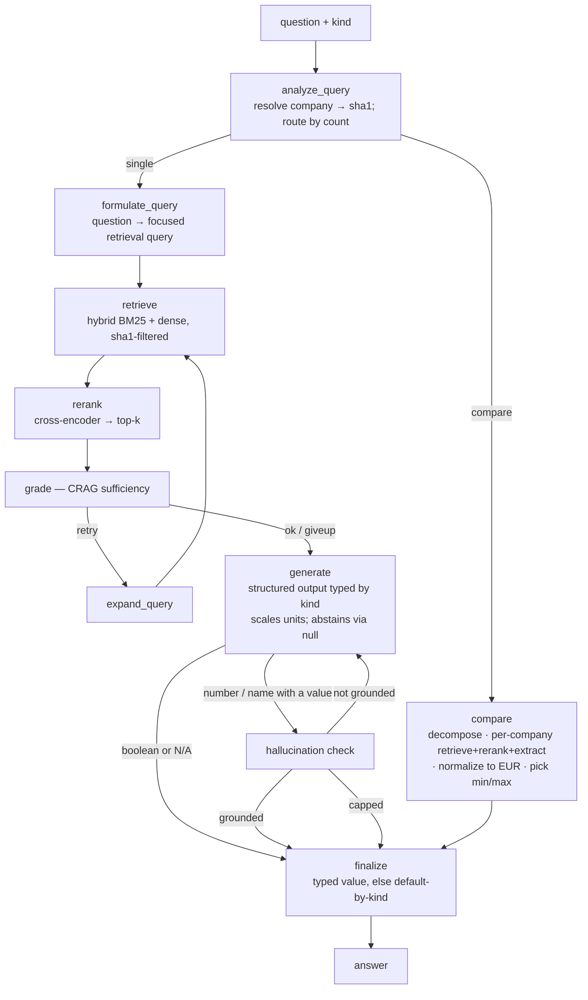

# Enterprise RAG — Annual Report Q&A

A Retrieval-Augmented Generation (RAG) system that reads company **annual reports** and answers typed questions about them.

**Dataset:** [Enterprise RAG (markdown)](https://www.kaggle.com/datasets/rrr3try/enterprise-rag-markdown) — `rrr3try/enterprise-rag-markdown`

---

## 1. Problem

A friendly competition to build a RAG system that can read annual reports and answer questions about them. Each question targets **one named company** (or, for comparison questions, a small set) and expects a **strictly typed** answer.

### Answer types (`kind`) — 100 questions
| kind | count | answer shape | abstention default |
|------|-------|--------------|--------------------|
| `number`  | 58 | a single number | `"N/A"` |
| `boolean` | 24 | `True` / `False` | `False` |
| `names`   | 9  | list of names/titles | `"N/A"` |
| `name`    | 9  | single name (8 are cross-company comparisons) | `"N/A"` |

> Returning the correct **default when the fact isn't in the report** is part of the score — abstention is a first-class feature, not an edge case.

## 2. Data

Located in `data/`:

- **100 annual reports**, each as both `.pdf` and pre-converted markdown:
  `EnterpriseRAG_2025_02_markdown/<sha1>/<sha1>.md` (+ extracted figure/table images).
- **`questions.json`** — 100 questions, each with `text` and `kind`.
- **`subset.json`** — one record per report keyed by `sha1` (the filename), with `company_name`, `major_industry`, `cur` (currency), and ~18 topic flags (`has_layoffs`, `has_share_buyback_plans`, `has_dividend_policy_changes`, …).
- **No official answer key.** A hand-verified dev set was built instead — see [Evaluation](#6-evaluation).

## 3. Key design decisions

| Decision | Choice | Why |
|----------|--------|-----|
| **Doc routing** | Every question names its company → map to `sha1` via `subset.json` | The "which document?" problem is handed to us — no need to search across all 100 |
| **Anti-contamination** | Single vector collection + **metadata filter** on `sha1` | Hard pre-filter makes cross-company contamination *structurally impossible*; simpler than 100 separate collections at this scale |
| **Chunking** | **Topic/heading-based + tables as standalone chunks** | Financial answers live in tables; naive character splitting severs numbers from labels/units |
| **Vocabulary gap** | **Hybrid search** (BM25 + dense) + **abbreviation enrichment at ingestion** | Tables embed poorly for prose queries (BM25 saves them); doc-specific acronyms (e.g. `CTC`) are enriched inline so both retrievers match either form |
| **Retrieval quality** | **CRAG** grade → retry (query expansion) / give-up | Corrective loop when retrieval is weak |
| **Comparisons** | **Query decomposition** + per-sub-query company filter | "Lowest assets among 5 companies" can't be answered from one chunk — fan out, retrieve per company, aggregate |
| **Output** | **Structured output typed by `kind`** + default-by-kind on give-up | Scorer wants `406100000`, not "approximately $406.1M"; booleans default `False`, others `N/A` |

### Gotchas discovered while building the dev set
- **~40% of hard questions are `N/A`** — several metrics simply aren't reported (e.g. a biotech has no gross margin; a media co. reports no storage-TB). Don't fabricate.
- **`subset.json` flags ≠ boolean answers.** Found divergences (e.g. Poste Italiane `has_dividend_policy_changes=True`, but the text only acts *"in line with"* the existing policy). Use flags as hints, not truth.
- **Units & period** are where numbers die — tables are "in millions" with multiple year-columns. Retrieval is easy; picking the right cell/unit is the hard part.

### Refinements found via the dev set (after first eval)
Three bugs surfaced *only because* the dev set existed — each fixed:
1. **Grounding flip on booleans** — the hallucination check rejected correct `True`s and the giveup path defaulted them to `False`. Fix: **skip the grounding check for booleans and abstentions** (a boolean is decided *from* context, not fabricated). → `route_after_generate`.
2. **Number scale error** — the model returned the literal cell `406.1` under "(Dollars in millions)" instead of `406100000`. Fix: the `number` prompt now **scales to the base unit**. High-leverage for the 58 number questions.
3. **Narrative retrieval miss** — the raw yes/no question (e.g. "Did X announce…in the annual report?") buried the evidence at rank ~43. Fix: a **`formulate_query` step** rewrites the question into a focused retrieval query *before* the first retrieve; `N_CANDIDATES` 20→40.

## 4. Pipeline

### Ingestion (`ingestion/`, run once)
```
documents (.md)
   → extract_abbreviations.py   regex "Full Term (ABBR)" → data/abbreviations.json (per sha1)
   → enrich.py                  inline "CTC (cost to company)" — EMBED-ONLY (enriched text is
                                embedded; the clean text is stored as the document)
   → chunking.py                heading-based sections + tables as standalone chunks
                                (cells/separators compacted; big tables split with repeated header)
   → ingest.py                  embed enriched copy into ONE Chroma collection (sha1/company/
                                heading/is_table metadata) + pickle a BM25 corpus
```

### Query flow (`pipeline/`, LangGraph)



### Stage notes
- **analyze_query** — finds the company name(s) in the question, maps to `sha1` via `subset.json`, and routes: **`single`** (one company) or **`compare`** (multiple). Carries `kind` downstream. (No chitchat branch — every question is a knowledge question.)
- **formulate_query** — rewrites the question into a focused, synonym-rich retrieval query. Added after the dev set showed raw yes/no questions retrieve their evidence at rank ~43.
- **retrieve** — `HybridRetriever`: dense (Chroma) + BM25, both hard-filtered to the company's `sha1`, merged by Reciprocal Rank Fusion.
- **rerank** — bge cross-encoder reorders candidates and keeps the top-k (this is what pulls answer-bearing tables above chatty prose).
- **grade (CRAG)** — LLM sufficiency check; insufficient → one `expand_query` retry → else proceed (generate can still abstain).
- **generate** — `with_structured_output(schema_for_kind)`; the `number` prompt **scales units** to the base value; missing facts come back as `null`/empty.
- **hallucination check** — runs **only** for number/name/names that produced a concrete value (where fabrication is the risk); booleans and abstentions skip straight to finalize.
- **finalize** — emits the typed submission value, or the kind default (`False` for boolean, `N/A` otherwise) when ungrounded/empty.
- **compare** — for multi-company questions: decompose the metric, retrieve+rerank+extract a number per company, normalize to EUR (approximate static FX), pick min/max.

## 5. Cost / latency notes

This is an **offline, accuracy-first batch pipeline** (run once over 100 questions), so it deliberately sits at the "advanced agentic RAG" end (Adaptive / Self / Corrective-RAG family) — roughly 4–6 LLM calls per question (formulate, grade, generate, optional expand/verify), more on the compare path (one extraction per company). Models: **bge-small** embeddings, **bge-reranker-base** reranker, **Claude Haiku** for all LLM nodes. Levers that keep it sane:
- **Cheap model** (Haiku) for every node — speed/cost over the 100-question batch.
- **Conditional checks** — the hallucination check runs only on number/name answers that produced a value; booleans/abstentions skip it.

> For a real-time chatbot this would be too heavy — you'd trim to `formulate → retrieve → rerank → generate`. The complexity is justified here because latency is irrelevant and accuracy is everything.

## 6. Evaluation

No official answer key, so a **hand-verified dev set** lives at `data/dev_set_verified.json`:
- 13 questions spanning all 4 kinds, each with the answer, a **confidence** rating, and an **exact source quote + line number**.
- Includes the tricky cases on purpose: 5 `N/A` abstentions, one contested boolean (Poste Italiane), one ambiguous `name` (1-800-FLOWERS).

`evaluate.py` runs those questions through the graph and scores them (booleans/N-A auto-judged; numbers compared by value within 1%; names flagged for review).

**Latest:** **10/13 PASS (~12/13 defensible)** — booleans 4/4, numbers 5/5 (scale-correct), one remaining miss (#29 Datalogic leadership, a scattered-narrative `names` question).

## 7. Run

```bash
pip install -r requirements.txt
# API key is read from ../agentic-rag/.env (ANTHROPIC_API_KEY)
python ingestion/ingest.py        # build the index (Chroma + BM25) — run once
python run.py --limit 3           # smoke test
python run.py                     # full submission -> answers.json
python evaluate.py                # score against the dev set
```

## 8. Status — implemented

- [x] Ingestion: `extract_abbreviations.py`, `enrich.py` (embed-only), `chunking.py` (heading + table-aware)
- [x] Vector store + hybrid retrieval: `ingest.py`, `retrieval/hybrid_search.py` (Chroma + BM25 + RRF), `retrieval/reranker.py`
- [x] Pipeline: `pipeline/{state,schemas,nodes,graph}.py` (LangGraph) — analyze, formulate, retrieve, rerank, CRAG grade, generate, hallucination check, finalize
- [x] Comparison path: decompose + per-company retrieve/extract + EUR normalize
- [x] Structured typed output + default-by-kind
- [x] `run.py` (submission) and `evaluate.py` (dev-set scoring)

### Known gaps
- Comparison/EUR uses **approximate static FX** (`config.FX_TO_EUR`) — a real solution needs report-period rates.
- Scattered-narrative `names` questions (leadership changes) are the weakest area.
- A few oversized wide-table chunks can exceed the embedder/reranker 512-token window (see `chunking.py`).
