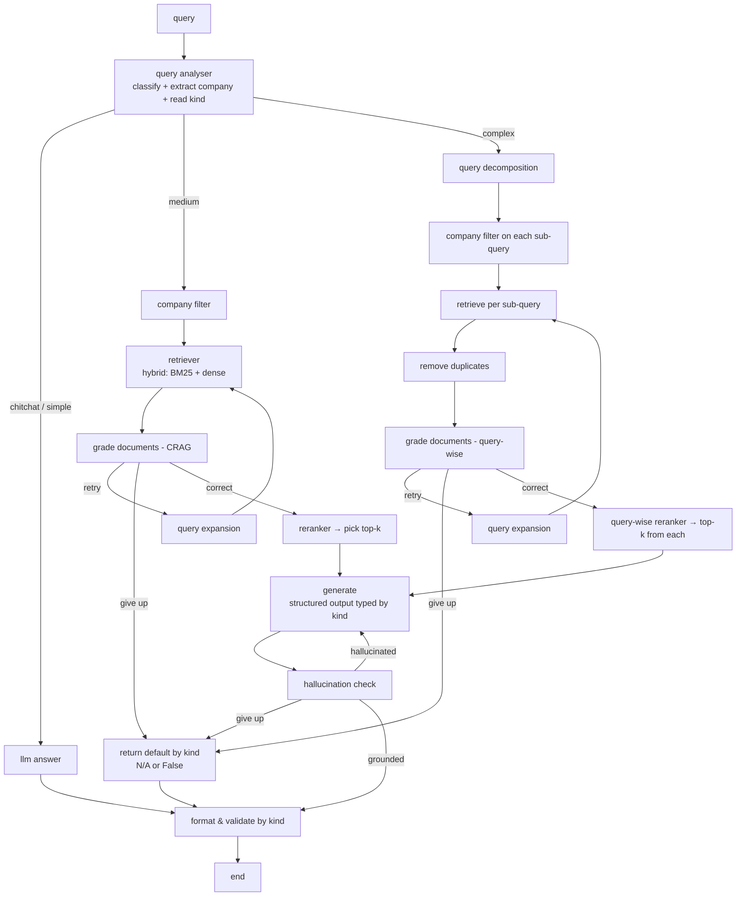

# Enterprise RAG — Annual Report Q&A

A Retrieval-Augmented Generation (RAG) system that reads company **annual reports** and answers typed questions about them.

**Dataset:** [Enterprise RAG (markdown)](https://www.kaggle.com/datasets/rrr3try/enterprise-rag-markdown) — `rrr3try/enterprise-rag-markdown`

---

## 1. Problem

A friendly competition to build a RAG system that can read annual reports and answer questions about them. Each question targets **one named company** (or, for comparison questions, a small set) and expects a **strictly typed** answer.

### Answer types (`kind`) — 100 questions
| kind | count | answer shape | abstention default |
|------|-------|--------------|--------------------|
| `number`  | 58 | a single number | `"N/A"` |
| `boolean` | 24 | `True` / `False` | `False` |
| `names`   | 9  | list of names/titles | `"N/A"` |
| `name`    | 9  | single name (8 are cross-company comparisons) | `"N/A"` |

> Returning the correct **default when the fact isn't in the report** is part of the score — abstention is a first-class feature, not an edge case.

## 2. Data

Located in `../archive/`:

- **100 annual reports**, each as both `.pdf` and pre-converted markdown:
  `EnterpriseRAG_2025_02_markdown/<sha1>/<sha1>.md` (+ extracted figure/table images).
- **`questions.json`** — 100 questions, each with `text` and `kind`.
- **`subset.json`** — one record per report keyed by `sha1` (the filename), with `company_name`, `major_industry`, `cur` (currency), and ~18 topic flags (`has_layoffs`, `has_share_buyback_plans`, `has_dividend_policy_changes`, …).
- **No official answer key.** A hand-verified dev set was built instead — see [Evaluation](#6-evaluation).

## 3. Key design decisions

| Decision | Choice | Why |
|----------|--------|-----|
| **Doc routing** | Every question names its company → map to `sha1` via `subset.json` | The "which document?" problem is handed to us — no need to search across all 100 |
| **Anti-contamination** | Single vector collection + **metadata filter** on `sha1` | Hard pre-filter makes cross-company contamination *structurally impossible*; simpler than 100 separate collections at this scale |
| **Chunking** | **Topic/heading-based + tables as standalone chunks** | Financial answers live in tables; naive character splitting severs numbers from labels/units |
| **Vocabulary gap** | **Hybrid search** (BM25 + dense) + **abbreviation enrichment at ingestion** | Tables embed poorly for prose queries (BM25 saves them); doc-specific acronyms (e.g. `CTC`) are enriched inline so both retrievers match either form |
| **Retrieval quality** | **CRAG** grade → retry (query expansion) / give-up | Corrective loop when retrieval is weak |
| **Comparisons** | **Query decomposition** + per-sub-query company filter | "Lowest assets among 5 companies" can't be answered from one chunk — fan out, retrieve per company, aggregate |
| **Output** | **Structured output typed by `kind`** + default-by-kind on give-up | Scorer wants `406100000`, not "approximately $406.1M"; booleans default `False`, others `N/A` |

### Gotchas discovered while building the dev set
- **~40% of hard questions are `N/A`** — several metrics simply aren't reported (e.g. a biotech has no gross margin; a media co. reports no storage-TB). Don't fabricate.
- **`subset.json` flags ≠ boolean answers.** Found divergences (e.g. Poste Italiane `has_dividend_policy_changes=True`, but the text only acts *"in line with"* the existing policy). Use flags as hints, not truth.
- **Units & period** are where numbers die — tables are "in millions" with multiple year-columns. Retrieval is easy; picking the right cell/unit is the hard part.

## 4. Pipeline

### Ingestion
```
documents (.md, assuming PDF→MD correctness)
   → extract abbreviations (per document)
   → enrich .md with abbreviations (inline, e.g. "CTC (cost to company)")
   → chunk: topic/heading-based + tables as separate chunks
   → ingest into vector store (single collection, sha1/company in metadata)
```

### Query flow



### Stage notes
- **query analyser** — classifies complexity (chitchat / medium / complex), extracts the target company, and carries the answer `kind` downstream as metadata. Use a cheap model here.
- **company filter** — resolves company → `sha1` and passes it as a hard metadata filter. For the comparison path it is applied **per decomposed sub-query** (each targets a different company).
- **CRAG grade** — scores retrieval relevance; low score → reformulate & retry, capped → give up to the default.
- **reranker** — cross-encoder reorders the top-k (distinct from the CRAG relevance score).
- **generate** — constrained to emit the exact type for the question's `kind`, with the abstention rule baked into the prompt.
- **format & validate** — final coercion to the required output shape; applies the default (`N/A` / `False`) for anything empty or unsupported. Every terminal path passes through here.

## 5. Cost / latency notes

This is an **offline, accuracy-first batch pipeline** (run once over 100 questions), so it deliberately sits at the "advanced agentic RAG" end (Adaptive / Self / Corrective-RAG family) — ~4 LLM calls on a clean medium path, 6–9 on the complex path. Levers that keep it sane:
- **Adaptive routing** — chitchat/simple skip the heavy path entirely.
- **Cheap model** (e.g. Haiku) for auxiliary calls (classify, grade, hallucination check); strong model only for `generate`.
- **Conditional checks** — e.g. run hallucination check only on `number`/`names` answers.

> For a real-time chatbot this would be too heavy — you'd trim to `retrieve → rerank → generate`. The complexity is justified here because latency is irrelevant and accuracy is everything.

## 6. Evaluation

No official answer key, so a **hand-verified dev set** lives at `../archive/dev_set_verified.json`:
- 13 questions spanning all 4 kinds.
- Each has the answer, a **confidence** rating, and an **exact source quote + line number** for verification against the `.md`/PDF.
- Includes the tricky cases on purpose: 5 `N/A` abstentions, one contested boolean (Poste Italiane), one ambiguous `name` (1-800-FLOWERS).

Verify the low-confidence rows manually, then use it as the measuring stick while tuning the pipeline.

## 7. Status

Architecture finalized. Remaining build tasks:
- [ ] Ingestion: abbreviation extraction + enrichment, heading/table-aware chunking
- [ ] Vector store with `sha1`/company metadata + hybrid retrieval
- [ ] Query analyser, company filter, CRAG loop, reranker
- [ ] Query decomposition + per-sub-query filtering for comparison questions
- [ ] Structured typed output + default-by-kind + format/validate node
- [ ] Run against `dev_set_verified.json`
